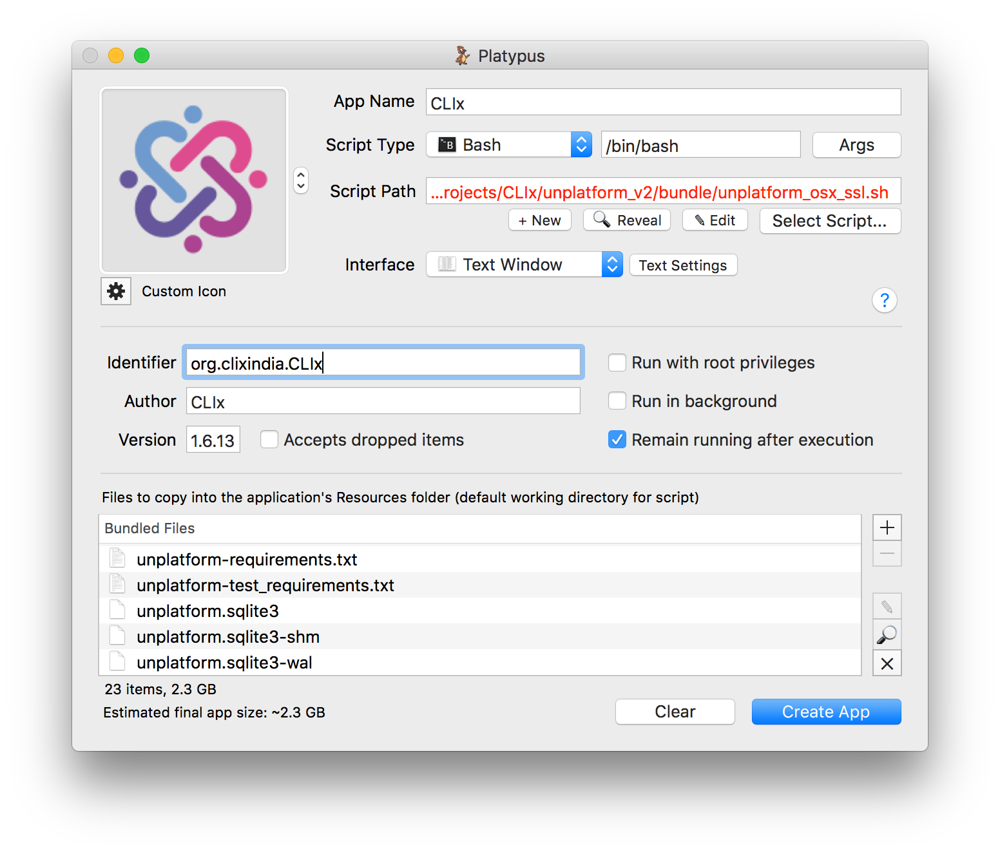

[](https://travis-ci.org/CLIxIndia-Dev/unplatform_v2)  [](https://coveralls.io/github/CLIxIndia-Dev/unplatform_v2?branch=master)

# Unplatform
The `unplatform` application is a generic, browser-based `ePub2` reader that can also support embedded assessments and interactive tools. Documentation on the architecture, software components, and how to build / use `unplatform` are hosted on the [GitHub project wiki](https://github.com/CLIxIndia-Dev/unplatform_v2/wiki). It is highly recommended to read through the Wiki before using `unplatform`, since many questions should already be answered there. Some general documentation is also provided in this README.

## Technical Requirements
This bundled app requires both `python 2.7` and `node.js`. One way to achieve both is to install `nodeenv` in a python virtual environment.

```
pip install -r requirements.txt
nodeenv -p
cd ui
npm install
```

Once you have your environment set up, you need to compile the UI JavaScript code
(see [Compiling the UI section](#compiling-the-ui-only-ie-for-development--testing)) for more details).

## Initializing the database
For a first-time install or migrating from an earlier version (which used filespace to store sessions), you have to create the `sqlite` database that will hold the web sessions. If you do not, you will see an error in the `unplatform` terminal like:

```
OperationalError: no such table: sessions
```

To create the sessions database, run the included `session_migration.py` script:

```
python session_migration.py
```

Then you can run the local webserver:

```
python main.py
```

And in a browser, navigate to `https://localhost:8888` (note the `https` --
  `http` will *not* work!).

# Compiling the UI only (i.e. for development / testing)

Make sure the node packages are installed in the `ui` directory via `cd ui && npm install`.

Then, from the project root directory (`unplatform_v2`):

```
npm run compile:ui
```

This will run `webpack` and dump the compiled CSS and JavaScript files in to the `static/ui` directory.


# Building a Basic Unplatform bundle
A shell script, `build_script_all_ssl.sh`, is included in this repository to create a basic `unplatform` bundle. A basic `unplatform` bundle is an intermediate step that creates a working version of `unplatform` with interactive tools, but does not make an easy, one-click installable file (i.e. a final distributable) with ePubs and assessments. To learn how to create a final distribution, see the section below.

A basic bundle includes:

* Unplatform epub reader
* QBank assessment engine
* A set of interactive tools (full list is [found in the wiki](https://github.com/CLIxIndia-Dev/unplatform_v2/wiki/Interactive-Tools))

This bundle does **not** include actual ePub content nor assessments, and the output of this script is a zip file. The distributor is responsible for unzipping the bundle, adding in ePub content and assessment data, and then re-packing for final distribution.

**NOTES:**

* You MUST run this script on the target platform. I.e. to bundle for Windows, run this on Windows.

* The build script assumes you have access to all the CLIx repositories on www.github.com. For some interactive tools, you may have to enter your SSH passphrase for each sub-repo, depending on how your machine is set up. (Use `ssh-agent` to eliminate this irritation.)

* The build script assumes you have a `node` installation available, along with `git` and various `bash` commands. On Windows, this means `git` bash, plus the `zip` module. See the separate [wiki page on bundling](https://github.com/CLIxIndia-Dev/unplatform_v2/wiki/Bundling-unplatform) for instructions on how to set up your environment.

* The build script has been tested on OS X Sierra, Ubuntu 16.04, and Windows 10, 32-bit.

* On Windows, you need `yarn` `0.23`+.

```
cd scripts/build_scripts
./build_script_all_ssl.sh
```

# Running Unplatform tests

Unplatform includes several tests for the server-side code. Unfortunately UI tests have not been included at this time.

You can run the tests locally from the command line.  Tests are also run through
the ``travis-ci`` continuous integration service each time a commit is pushed
to the repository.

The test suite includes unit tests, pylint analysis, pep8 compliance, and
python test coverage.

Run the test suite with this command:

```
pytest
```

Test options are configured in ``pytest.ini``.  Some options specific to each
test harness plugin are configured in their dedicated files.

Code coverage is configured in ``.coveragerc``.  You can view the detailed
coverage report by opening ``htmlcov/index.html`` in your browser.

Pep8 is configured in ``pytest.ini``.

Pylint is configured in ``.pylintrc``.

# StarLogoNova support
**NOTE** StarLogoNova support requires `qbank` `3.18.1` or higher.

# Logging

Unplatform will log UI click events to an internal logging API, which is routed
over to the associated qbank API (set in `settings.py` file). The types of events
logged are:

* In a Lesson or Tool, clicking "Yes" to the "Finish Lesson" modal.
* In a Lesson or Tool, clicking Choose Tool or Choose New Lesson.
* Selecting a Tool.
* Selecting a Breadcrumb element.
* Selecting a Subject / Unit / Lesson.


For the first two event types, the data sent to the server appears like:

```
{
  sessionId: <unplatform session ID>,
  appName: 'unplatform',
  action: 'clicked_choose_tool',
  params: {
    url: "<url of pre-click page>"
  }
}
```

Example:
```
{
  sessionId: "5a15c2e2be773168a5a048fc2739a4451870ad97",
  appName: 'unplatform',
  action: 'clicked_choose_tool',
  params: {
    url: "/subjects/English Beginner/units/Unit 1/lessons/Lesson 0"
  }
}
```

For the last three event types (simple navigation), the logged event looks like:

```
{
  sessionId: <unplatform session ID>,
  action: 'click',
  target: <location clicked>
}
```

Example:
```
{
  sessionId: "5a15c2e2be773168a5a048fc2739a4451870ad97",
  action: 'click',
  target: "Select Subject"
}
```

# Final Distribution Instructions
To create a final distribution, you can create an installable version of `unplatform` (with modules and assessment data). Example instructions and steps on how to do so are below. If you have other requirements for a final distribution (i.e. to include additional tools, synchronization software, etc.), you may have a different process to follow.

## Building a macOS Application
### Tools
To create a macOS application (i.e. `CLIx.app`), we use the [Platypus](http://sveinbjorn.org/platypus/) application to create the `.app` bundle, and [dmgbuild](https://github.com/al45tair/dmgbuild) to create a distributable installer.

### Build Steps
1. Run the `build_script_all_ssl.sh` script in `scripts/build_scripts`.
2. Open Platypus.
3. Set `Script Type` to `Bash`.
4. Set `Script Path` to point to `bundle/unplatform_osx_ssl.sh`.
5. Update the `App Name` to just say `CLIx`.
6. Set the `Custom Icon` to the file from `bundle/static/assets/clix.png`.
7. Set the `Identifier` to `org.clixindia.CLIx`.
8. Set the `Author` to `CLIx`.
9. Set the `Version` to match the unplatform version.
10. Add to `Bundled Files` all of the directories and files in `bundle/` **except** the `unplatform_*.zip` file -- you don't need to re-include the zipped bundle.
11. Check that the fields look like this screenshot. 
12. Click `Create App`.
13. Select the target output directory from the pop-up.
14. Wait. Sometimes Platypus will appear to hang / show a beach ball when it is copying over a large number of files. Be patient. When it is done, the screen will become interactive again.
15. Verify that your output `CLIx.app` file runs. Double-clicking it should cause `Terminal` to run both `unplatform` and `qbank`, and in a browser you should be able to navigate to `https://localhost:8888` (if Chrome does not automatically open it) and interact with the modules. **NOTE:** Because we have not signed the application with Apple Developer certificates, users will get a warning when they attempt to run this for the first time. They can option-click on the application, then click "Open anyways" to bypass the security check.
16. Now we create a `CLIx.dmg` installer so you can distribute the application.
17. In a virtual environment (preferred) or just in your global directory, type in `pip install dmgbuild` in a `Terminal` window.
18. Depending on how many modules you are including, and the expected size of the final `.dmg` file, you may need to adjust the `size` value in `clix_settings.py` (line 46). Currently it is set to `3GB`.
19. Run `dmgbuild -s clix_settings.py "CLIx" CLIx.dmg`
20. Wait. You should see your `CLIx.dmg` file appear soon. Now you can distribute this to others.

## Bundling into a Windows .exe Installer
### Tools
Because the bundled files can reach over 2GB in size, you have to build this installer on a 64bit Windows machine (you can create a 32bit installer still). You'll also need [NSISBI](https://sourceforge.net/projects/nsisbi/), plus all of the dependencies listed in its `INSTALL` file. You will have to build NSISBI from source.

1. Download and extract [NSISBI](https://sourceforge.net/projects/nsisbi/).
2. Install [Python 2.7.14](https://www.python.org/downloads/release/python-2714/) (SCONS, the compiler used for NSISBI, does not support Python 3+).
3. Install [SCONS 3](http://scons.org/pages/download.html).
4. Download and extract the precompiled [zlib 1.2.7 dll](http://nsis.sourceforge.net/Zlib).
5. Install a [Visual C++ compiler](http://landinghub.visualstudio.com/visual-cpp-build-tools). I used the 2015 build tools, and it worked fine.
6. In `Command Prompt`, set the `ZLIB_W32` environment variable to where you extracted `zlib` from step 4. `set ZLIB_32=C:\<path>\zlib127`.
7. Download and install [wxWidgets](https://wxwidgets.org/downloads/).
8. Run an elevated `Command Prompt` (right-click and select `Run as administrator`).
9. In the elevated `Command Prompt`, navigate to the `NSISBI` folder that you extracted in step 1. Build with `scons PREFIX="C:\Program Files\NSIS" install`.
10. Once the installation has finished, you can use `Explorer` to navigate to `C:\Program Files\NSIS`. You should see `makensisw.exe` -- that's what we'll use to build the CLIx Installer.
11. Now, you need to install the `inetc` plugin for `NSIS`. Download and unzip [Inetc.zip](http://nsis.sourceforge.net/Inetc_plug-in).
12. Copy `Inetc\Plugins\x86-unicode\INetC.dll` to `C:\Program Files\NSIS\Plugins\x86-unicode`.
13. Copy `Inetc\Plugins\x86-ansi\INetC.dll` to `C:\Program Files\NSIS\Plugins\x86-ansi`.

### Build Steps
1. Run the `build_script_all_ssl.sh` script in `scripts\build_scripts`. OR, download a pre-bundled `*.zip` file from Google Drive and extract everything.
2. Copy the modules you want installed to `bundle\modules`.
3. Copy the corresponding unzipped `webapps` data bundle to `bundle\webapps`.
4. Run the `C:\Program Files\NSIS\makensisw.exe` program.
5. In NSIS, click `File`, and load the `bundle\clix.nsi` script. Watch it build.
6. Now you have a `CLIxInstaller.exe` that you can distribute!


## Bundling into a Debian .deb package (i.e. for Ubuntu)
### Tools
The build scripts and steps provided here have been tested on Ubuntu 16.04, but theoretically should work on any other Debian platform.

You do not need any additional tools -- the build script provided will download and install the tools that it needs.

### Build Steps
1. Build the bundle or unzip a prepared bundle.
2. Copy in the `modules` and `webapps` files into the `bundle/` directory.
3. Run the `build_debian_package.sh` script. You will get prompted for two things:
  - Your `sudo` password, to install some of the Debian build tools.
  - Verify that the Debian build information (e-mail, version, contact, etc.) are correct.
4. Wait.
5. After the build process is finished, you should see a Debian package in the `clix/` directory (sibling to `bundle/`).

To install, you can use a package manager like [GDebi](https://apps.ubuntu.com/cat/applications/precise/gdebi/). **NOTE** that there is a [bug in Ubuntu](https://bugs.launchpad.net/ubuntu/+source/gnome-software/+bug/1573206), that may prevent from using the default Software Center to install third-party `deb` packages. Alternatively, you can install from the command-line, using `sudo dpkg -i <filename>.deb`.


# Wiki Documents
More detailed documentation about how to use the platform is located [in the wiki](https://github.com/CLIxIndia-Dev/unplatform_v2/wiki). The set of topics discussed include:

* [Structure of the code repository](https://github.com/CLIxIndia-Dev/unplatform_v2/wiki/Repository-structure)
* [How to develop and test unplatform locally](https://github.com/CLIxIndia-Dev/unplatform_v2/wiki/Developing-and--testing-locally)
* [Bundling unplatform](https://github.com/CLIxIndia-Dev/unplatform_v2/wiki/Bundling-unplatform).
* [Installing unplatform and where to put data files](https://github.com/CLIxIndia-Dev/unplatform_v2/wiki/Field-installation-and-data-files).
* [Testing the installation to make sure it works](https://github.com/CLIxIndia-Dev/unplatform_v2/wiki/Verifying-the-Bundle).
* [List of interactive tools and how to get them in different languages](https://github.com/CLIxIndia-Dev/unplatform_v2/wiki/Interactive-Tools).
* [SSL certificates](https://github.com/CLIxIndia-Dev/unplatform_v2/wiki/SSL-Certificates)

# ACKNOWLEDGEMENTS
This software uses many third-party software packages, and the authors are grateful
for every one. The majority can be found listed in `ui/package.json` or `requirements.txt`.
All third-party software remains copyright by the respective author(s) and may have
different license requirements than this software.

In addition, the authors would like to acknowledge the use of the following packages:

## Front-end CSS / fonts
- Font Awesome
- Rich Clark / Eric Meyer (HTML5 reset CSS; CC BY-NC 2.0 UK)
- Graham Miller (Responsive Grid System; CC BY 3.0)
- Font Squirrel (OpenSans fonts; licensed Apache V2)
- Joe Prince, Adminx Designs (Varela; SIL OPEN FONT LICENSE Version 1.1)

## Python libraries:
- PyOpenSSL (Apache v2)
- Cryptography (Apache v2)
- Requests (Apache v2)
